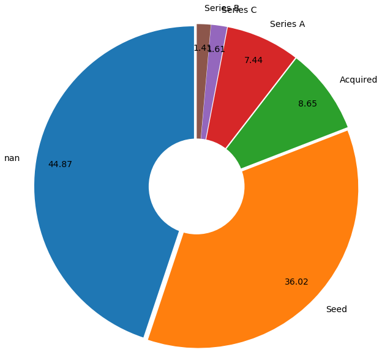

# Analyzing the characteristics and global distribution of Data and AI startups


I love startups and how there is no bound to what one could do to make this world a better place. And, since I work in Data and AI domain, I was more interested in exploring the Data and AI startups on AngelList. Gathering data from AngelList was not trivial as it would not let you export more than a 100 records at a go. So, I applied multiple filters, like Type=”Startup”, Market=”Big Data Analytics”, “Data Science”, “Big Data”, “Machine Learning, Predictive Modeling”, “Computer Vision”, “Natural language Processing”, “Neural Networks”, “Deep Learning”, “Reinforcement Learning” and then excluded the duplicates later as results of these filters were having an overlap in few operations. I got less than 100 records 26 times, hence created 26 .csv files. Finally, I merged these .csv files in one .csv using the following command and added header to the dataframe later.

sed 1d companies*.csv > startup.csv

This is a peek into the initial dataset.

df=pd.read_csv("startup.csv",names=["Name","Profile URL","Signal","Joined","Location","Market","Website","Employees","Stage","Total Raised"])


I worked on this dataset to split 'Joined' to 'Joining_Year' and 'Joining_Month' and dropped 'Joined' , appended '20' in front of year, removed duplicate rows using the following commands.

df.drop_duplicates(keep=False,inplace=True)
df[['Joining_Month','Joining_Year']]=df.Joined.str.split("'",expand=True)
df.drop(['Joined'], axis=1, inplace=True)
df['Joining_Year'] = ('20' + df['Joining_Year'])
df.head()


Using Counter from python, I found out top 10 startup markets using following code.

from collections import Counter
c=Counter(df.Market)
histo=c.most_common(10)
freq={}
for item,count in histo:
    freq[item]=count
explode = (0.05,0.05,0.05,0.05,0.05,0.05,0.05,0.05,0.05,0.05)
plt.pie([float(v) for v in freq.values()], labels=[(k) for k in freq],
           autopct='%.2f',startangle=90, pctdistance=0.85, explode = explode,radius=3,textprops={'fontsize': 14})
centre_circle = plt.Circle((0,0),0.90,fc='white')
fig = plt.gcf()
fig.gca().add_artist(centre_circle)
plt.tight_layout()
plt.show()


##### Top 10 Startup Markets in Data/AI. We see SaaS is the leader followed by 'Big Data Analytics', 'Predictive Analytics' and 'IoT'.

Similarly, I worked to find multiple attributes on these startups, for which you can find the donut charts as below.

##### Distribution of number of employees across startups. 'nan' indicates that number was not specified in the AngelList database for these companies.


##### Top 10 cities across the world for DS/AI startups, note 7 are in the USA with the exception of Berlin and London. 'nan' indicates that city was not specified in the AngelList database for these companies.


##### Distribution of funds raised across the startups. 'nan' indicates that funds raised was not specified in the AngelList database for these companies.


##### Distribution of the stages of the startup. As we see majority are in 'nan' stage, this indicates that stage was not specified in the AngelList database for these companies. Amongst the valid stages, most startups are in seed stage, which makes sense, as initially startups struggle to get funded.

Post this, I thought of painting the startup across the globe for prior and post 2013 era. I used the following code for this. I downloaded 'continentsshp31.shp' from IGIS MAP (found by googling). Also, to plot this dataframe on the map, I needed longitude and latitude for each city, which I calculated using geopandas.

```
#install the following libraries
# !pip3 install geopandas
# !pip3 install descartes
# !pip install geopy
import matplotlib.pyplot as plt
import geopandas
from geopy.geocoders import Nominatim
world = geopandas.read_file("continentsshp3147/continentsshp31.shp")
geolocator = Nominatim(user_agent="ds")
# code to retrieve latitude and longitude
from geopy.extra.rate_limiter import RateLimiter
# 1 - convenient function to delay between geocoding calls. I did this in groups of 100 as the service was getting timed out. Later, I combined all slices.
geocode = RateLimiter(geolocator.geocode, min_delay_seconds=1)
# 2- - create location column
df_100=df[:100]
df_100['location'] = df_100['Location'].apply(geocode)
# 3 - create longitude, latitude, altitude from location column (returns tuple)
df_100['point'] = df_100['location'].apply(lambda loc: tuple(loc.point) if loc else None)
# 4 - split point column into latitude, longitude and altitude columns
df_100[['latitude', 'longitude', 'altitude']] = pd.DataFrame(df_100['point'].tolist(), index=df_100.index)
# combine the slices with latitude and longitude
df_new = pd.concat([ df_100,df_101_200,df_201_300,df_301_400,df_401_497])
df_new = df_new.sample(frac=1).reset_index(drop=True)
df_new.head()
```
The resulting dataframe looks as below.
                  
:-------------------------:|:-------------------------:
  |  

The next step is to get the data in the geometrical format. The way to do this is to convert Pandas DataFrame into a geo-DataFrame, which needs parameters as the original DataFrame, coordinate reference system (CRS), and the geometry of the new DataFrame. In order to format the geometry appropriately, we need to convert the longitude and latitude into Points (we imported Point from shapely above), so let's pass the pandas dataframe and get the latitude and longitude using EPSG:4326 CRS.

```
from shapely.geometry import Point, Polygon
crs={'init': 'epsg:4326'}
geometry=[Point(xy) for xy in zip(df_new["longitude"],df_new["latitude"])]
geo_df=gpd.GeoDataFrame(df_new,crs=crs,geometry=geometry)
fig, ax = plt.subplots(figsize=(20, 20))
world.plot(ax=ax,alpha=0.4,color='grey')
geo_df[(geo_df['Joining_Year']).astype(str).astype(int)>2013].plot(ax=ax,markersize=20,color='green',marker="o",label="2014-2018")
geo_df[(geo_df['Joining_Year']).astype(str).astype(int)<=2013].plot(ax=ax,markersize=20,color='red',marker="^",label="2010-2013")
plt.legend(prop={'size':15})
plt.title("Global distribution of DS/AI Startups joining AngelList before and after 2013")
```
The resulting plot looks as below. We see that (as on the right side in green) few startups sprung between 2014–2018 in the non-prime startup zones. Also, majority of the world looks devoid of an entrepreneurial mindset :). Startup culture is primarily centralized across United States, UK and few parts of Europe.


I also plotted another geopandas map to see the global distribution and density of funds raised.


There is a lot more insights, which can be derived from this dataset. If you are interested in working with this dataset, I have uploaded this on kaggle link here (https://www.kaggle.com/shilpibhattacharyya/dataai-startups-dataset-from-angellist) - kindly request access.


